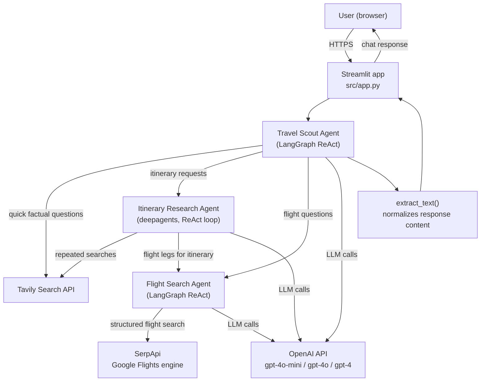
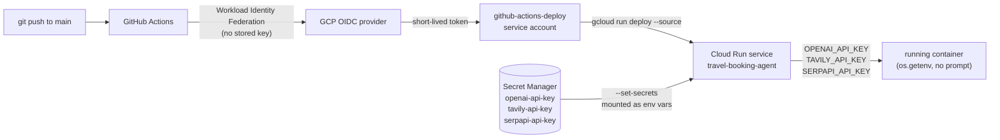

# Travel Booking AI Agent ✈️

A multi-agent travel planning system by Parag Lad that answers travel questions and plans day-by-day itineraries using LangGraph and deep research.

## 📋 Project Overview

This project:
- Answers general travel questions (weather, visas, packing, destination comparisons)
- Plans complete day-by-day travel itineraries
- Routes each query to the right agent: quick lookup vs. deep research
- Cites sources for its research
- Ships a Streamlit chat interface

## 🎯 Features

✅ **Travel Scout Agent** - Routes queries and answers general travel questions
✅ **Itinerary Research Agent** - Deep, multi-step research for full itineraries
✅ **Flight Search Agent** - Real flight options (price, airline, duration, stops) via Google Flights data
✅ **Real-Time Web Search** - Tavily-powered research with source citations
✅ **Multi-Agent Coordination** - LangGraph ReAct agents + deep research sub-agent, composed as tools
✅ **Web Interface** - Streamlit chat UI

## 🌐 Live App

**https://travel-booking-agent-561690375744.us-central1.run.app**

Deployed on Google Cloud Run, auto-deploying on every push to `main` via GitHub Actions (keyless auth via Workload Identity Federation - no secrets stored in GitHub). The OpenAI, Tavily, and SerpApi API keys are configured server-side via Google Secret Manager - no key prompt, just open it and ask.

## 🏗️ Architecture

### Request flow



The Travel Scout agent decides per-message whether to answer directly from a Tavily search, delegate to the Itinerary Research Agent (a multi-step ReAct loop making its own Tavily and flight calls) for full day-by-day plans, or delegate to the Flight Search Agent for direct flight questions. The Itinerary Research Agent also calls the Flight Search Agent itself so generated itineraries include real flight options, not guessed ones.

**Travel Scout Agent** (main coordinator, LangGraph ReAct)
- Answers general travel questions directly via web search
- Delegates itinerary requests to the research agent, flight questions to the flight agent
- Synthesizes results and cites sources

**Itinerary Research Agent** (deep research sub-agent, `deepagents`)
- Multi-step ReAct research loop over Tavily search results
- Calls the Flight Search Agent to include real flights in the itinerary when origin/dates are known
- Produces structured, day-by-day itineraries

**Flight Search Agent** (LangGraph ReAct)
- Resolves city names to IATA airport codes and normalizes dates
- Calls `search_flights`, a tool wrapping SerpApi's Google Flights engine, for real prices/times/stops
- Never invents flight details - reports only what the tool returns, or asks a clarifying question if origin, destination, or dates are ambiguous

### Deployment & secrets pipeline



Nothing sensitive ever touches GitHub or the repo: deploy auth is a short-lived OIDC token (Workload Identity Federation, no service account key), and the API keys live only in Secret Manager, referenced by name+version - never written to source, Docker image, or GitHub Actions logs.

## 📁 Project Structure

```
4-Travel-Booking-AI-Agent/
├── README.md                           # This file
├── requirements.txt                    # Python dependencies (notebook/dev)
├── Dockerfile                          # Container image for Cloud Run
├── notebooks/
│   └── Multi_Agent_Travel_Planner.ipynb
└── src/
    ├── app.py                          # Streamlit application
    └── requirements.txt                # Streamlit app dependencies
```

## 🚀 Quick Start

### Prerequisites
- Python 3.11+ (required by the `deepagents` dependency)
- An OpenAI API key
- A Tavily API key (for web search) — get a free key at [tavily.com](https://tavily.com)
- A SerpApi API key (for flight search) — get a free key at [serpapi.com](https://serpapi.com) (250 free searches/month)

### Installation

```bash
# Navigate to project
cd 4-Travel-Booking-AI-Agent

# Install dependencies
pip install -r src/requirements.txt
```

### Run the Streamlit App

```bash
streamlit run src/app.py
```

### Run Jupyter Notebook

```bash
jupyter notebook notebooks/Multi_Agent_Travel_Planner.ipynb
```

## 💻 Usage Examples

### General Travel Question
```
User: "What's the best season to visit Japan?"
Agent: Uses internet_search to provide seasonal guidance with sources
```

### Detailed Itinerary
```
User: "Plan a 5-day trip to Tokyo for a first-time visitor"
Agent: Routes to the itinerary research agent for a full day-by-day plan,
       including real flight options if you mention your origin city and dates
```

### Flight Search
```
User: "Find flights from JFK to NRT on 2026-09-10, returning 2026-09-20"
Agent: Routes to the flight search agent, which calls search_flights and
       reports real prices, airlines, durations, and stops
```

## 🔑 Environment Variables & Secrets

The app reads these from the environment - no in-app prompt:
```
OPENAI_API_KEY=your_api_key_here
TAVILY_API_KEY=your_tavily_key
SERPAPI_API_KEY=your_serpapi_key
```

### How they're injected on Cloud Run

1. **Storage**: The actual key values live only in Google Secret Manager, as secrets `openai-api-key`, `tavily-api-key`, and `serpapi-api-key` in the GCP project - never in this repo, never in the Docker image, never in GitHub.
2. **Access grant**: Both the Cloud Run runtime service account and the GitHub Actions CI service account are granted `roles/secretmanager.secretAccessor` on each secret (nothing else can read them).
3. **Deploy-time wiring**: The deploy command includes
   ```
   --set-secrets OPENAI_API_KEY=openai-api-key:latest,TAVILY_API_KEY=tavily-api-key:latest,SERPAPI_API_KEY=serpapi-api-key:latest
   ```
   which tells Cloud Run to mount the latest version of each secret as a regular environment variable inside the container at startup - Cloud Run's control plane fetches the value from Secret Manager on the runtime service account's behalf; the value is never written to the service's YAML config in plaintext.
4. **App code**: `src/app.py` just calls `os.getenv("OPENAI_API_KEY")` / `os.getenv("TAVILY_API_KEY")` / `os.getenv("SERPAPI_API_KEY")` like any normal env var - the app itself has no knowledge that Secret Manager exists.

Rotating a key is just `gcloud secrets versions add <secret-name> --data-file=-` with the new value, then redeploying (or waiting for the next deploy) - no code change needed.

## 📚 Key Technologies

- **LangGraph** - Multi-agent orchestration (ReAct agents)
- **deepagents** - Deep research sub-agent for itinerary planning
- **OpenAI** - GPT model access
- **Tavily** - Web search integration
- **SerpApi (Google Flights)** - Real flight search data
- **LangChain** - LLM framework

## 💡 Tips

### Optimize Costs
- Use GPT-4o-mini for cost efficiency
- Ask follow-up questions instead of broad, open-ended ones

### Improve Accuracy
- Provide clear constraints (dates, budget, interests)
- Validate sources cited in the response

## 📈 Future Enhancements

- [ ] Hotel search integration
- [ ] Booking integration
- [ ] Real-time notifications

## 📝 License

MIT License — © Parag Lad
