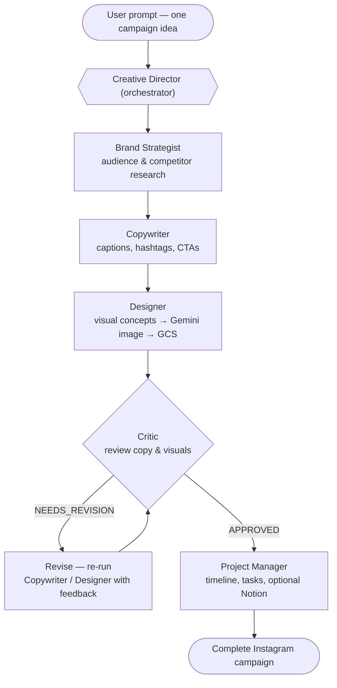

# Build a Multi-Agent Creative Studio with Google's Agent Stack: ADK, A2A, MCP on Cloud Run & Agent Runtime

A hands-on codelab for building a distributed multimodal multi-agent system using **Google ADK**, **A2A protocol**, **MCP**, and **Gemini Enterprise Agent Platform Runtime**. Participants build a complete Instagram campaign generator from scratch, deploying five specialist agents that collaborate through A2A communication.

## What You Build

A distributed multi-agent creative studio where specialized AI agents collaborate to produce complete Instagram campaigns:

| Agent | Role |
|---|---|
| **Brand Strategist** | Market research, competitor analysis, audience insights |
| **Copywriter** | Instagram captions using ADK Skills (platform guidelines + caption formulas) |
| **Designer** | Visual concepts + real image generation via Gemini, stored in GCS |
| **Critic** | Quality review with structured APPROVED / NEEDS_REVISION scores |
| **Project Manager** | Campaign timeline, tasks, and optional Notion integration via MCP |

Coordinated by a **Creative Director** orchestrator that sequences the agents, handles the Critic's revision loop, and compiles the final campaign.

### How the agents collaborate

The Creative Director runs the specialists as a pipeline: research feeds the copy, the copy informs the visuals, and the **Critic** gates the result. When the Critic returns `NEEDS_REVISION`, the Director loops back to the Copywriter and/or Designer with the specific feedback before continuing — only an `APPROVED` review reaches the Project Manager, who assembles the final timeline.



## Key Concepts Covered

- Building ADK agents with tools, callbacks, and system instructions
- **ADK Skills** - packaging reusable knowledge into modular files loaded on demand
- **Multimodal** - bridging a text agent to an image model via a `FunctionTool`
- **A2A protocol** - agents communicating over HTTPS as independent services
- **MCP toolsets** - connecting agents to external services (Notion) without custom glue code
- **`after_tool_callback`** - intercepting tool responses for error handling and schema injection
- Deploying agents to **Cloud Run** and **Gemini Enterprise Agent Platform Runtime**

## Repository Structure

```
.
├── docs/                           ← published codelab (codelab.json + index.html) — GitHub Pages source
├── LICENSE
├── README.md
└── workshop/
    ├── diagrams/                   ← screenshots and GIFs used in the codelab
    ├── setup_inspector.sh          ← A2A Inspector setup helper
    └── starter/                    ← participant starting point (TODOs to fill in)
        ├── agents/
        │   ├── brand_strategist/
        │   ├── copywriter/         ← includes ADK Skills (instagram-copywriting)
        │   ├── designer/           ← Gemini image generation + GCS upload
        │   ├── critic/
        │   ├── project_manager/    ← Notion MCP integration + error handling callback
        │   └── creative_director/  ← orchestrator with Critic revision loop
        └── deploy/                 ← Cloud Run + Gemini Enterprise Agent Platform deployment scripts
```


## Prerequisites

- Google Cloud project with billing enabled
- APIs: Vertex AI, Cloud Run, Cloud Storage, Secret Manager
- `gcloud` CLI authenticated

## Getting Started

```bash
git clone https://github.com/ANI-IN/Multi-Agent-Creative-Studio.git
cd Multi-Agent-Creative-Studio/workshop/starter
uv sync
cp .env.example .env
# Fill in .env with your project values
uv run adk web agents --allow_origins='*'
```

Full step-by-step instructions are in the published codelab at [codelabs.developers.google.com/ai-creative-studio-adk-a2a](https://codelabs.developers.google.com/ai-creative-studio-adk-a2a).

## Tech Stack

- [Google ADK](https://adk.dev) `1.31.1`
- [A2A Protocol](https://github.com/google/A2A)
- Gemini models (text + image generation) on Vertex AI
- Cloud Run, Gemini Enterprise Agent Platform Runtime, Cloud Storage
- MCP (Model Context Protocol) for Notion integration
